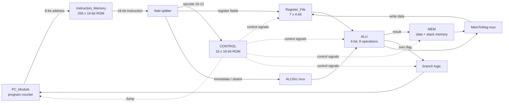
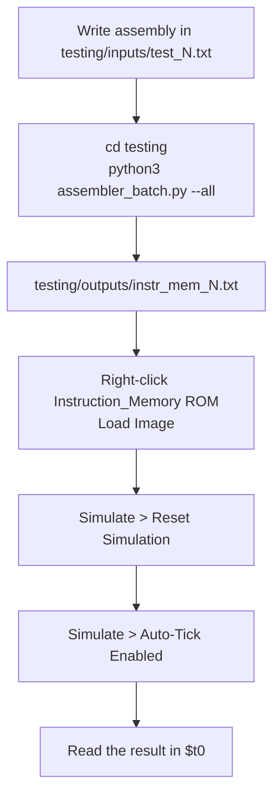

# 4-bit MIPS Processor

A working 4-bit MIPS processor designed and simulated in **Logisim Evolution**, built for
CSE 210 (Computer Architecture Sessional), January 2026 semester, BUET.

The machine has a 16-bit instruction word, a 4-bit data path, an 8-bit address bus, seven
4-bit registers, separate instruction and data memories, a stack, and a **microprogrammed
control unit** driven by a ROM. Assembly programs are converted to machine code by a Python
assembler included in this repo.

**Lab Group B1 &middot; Group ID 3**

---

## Requirements

| Tool | Version |
|---|---|
| Logisim Evolution | **v4.1.0** |
| Python | 3.8 or newer (standard library only, no packages to install) |

Open `MIPS_Processor.circ` in Logisim Evolution v4.1.0. Older Logisim (the original
2.7.1) will not open this file — the subcircuit appearance format and several component
attributes are Evolution-specific.

---

## Repository layout

```
.
├── MIPS_Processor.circ                the full processor — open this in Logisim Evolution
├── README.md
│
├── docs/
│   ├── B1_Group3_MIPS_4-bit_Report.pdf    the written report
│   ├── Instruction_Table.pdf              our B1-3 opcode assignment
│   └── Jan_2026_CSE_210_MIPS.pdf          the assignment specification
│
├── individual_modules/                modules developed and tested separately, before integration
│   ├── Control_Unit.circ
│   ├── Instruction_Memory_Unit.circ
│   ├── Memory_Unit.circ
│   ├── mipsALU.circ
│   ├── PC_Unit.circ
│   └── Register_File_Unit.circ
│
└── testing/
    ├── assembler.py                    assembler, single file at a time
    ├── assembler_batch.py              assembler, whole inputs/ folder at once
    ├── control_rom.txt                 16 control words -> load into Control_ROM
    ├── instruction_memory.txt          a sample assembled program -> load into Instruction_Memory
    ├── tests.txt                       all ten test programs in one readable file
    ├── inputs/                         test_1.txt … test_10.txt
    └── outputs/                        instr_mem_1.txt … instr_mem_10.txt (generated)
```

`MIPS_Processor.circ` is the integrated design and the only file you need to open to run
anything. The six circuits under `individual_modules/` are kept for reference and for the
report — they show each module as it was built and tested in isolation before being merged
into the top-level circuit.

---

## The instruction set

Every group in the course gets a different opcode ordering. Ours is the **B1, Group 3**
sequence: `OJNCAEPLGKMFDBHI`.

| Instruction Code | Instruction ID | Instruction Type | Instruction |
|:---:|:---:|---|:---:|
| `0000` | O | Control &nbsp;[I] | `bneq` |
| `0001` | J | Logic &nbsp;&nbsp;[S] | `srl`  |
| `0010` | N | Control &nbsp;[I] | `beq`  |
| `0011` | C | Arithmetic [R] | `sub`  |
| `0100` | A | Arithmetic [R] | `add`  |
| `0101` | E | Logic &nbsp;&nbsp;[R] | `and`  |
| `0110` | P | Control &nbsp;[J] | `j`    |
| `0111` | L | Memory &nbsp;&nbsp;[I] | `lw`   |
| `1000` | G | Logic &nbsp;&nbsp;[R] | `or`   |
| `1001` | K | Logic &nbsp;&nbsp;[R] | `nor`  |
| `1010` | M | Memory &nbsp;&nbsp;[I] | `sw`   |
| `1011` | F | Logic &nbsp;&nbsp;[I] | `andi` |
| `1100` | D | Arithmetic [I] | `subi` |
| `1101` | B | Arithmetic [I] | `addi` |
| `1110` | H | Logic &nbsp;&nbsp;[I] | `ori`  |
| `1111` | I | Logic &nbsp;&nbsp;[S] | `sll`  |

### Instruction formats

All instructions are 16 bits, split into four 4-bit fields.

```
R-type    opcode | src1 | src2 | dst          add $t1, $t2, $t3
S-type    opcode | src1 | dst  | shamt        sll $t0, $t1, 2
I-type    opcode | src1 | dst  | immediate    addi $t0, $t1, 5
J-type    opcode |  target address  | 0000    j  loop
```

Note the operand order flips for R-type and S-type: you *write* the destination first, as in
normal MIPS assembly, but it is *encoded* last (R-type) or third (S-type). The assembler
handles this for you.

### Registers

| Name | Number | Notes |
|---|---|---|
| `$zero` | `0000` | hardwired to 0, writes are ignored |
| `$t0` | `0001` | general purpose — test programs leave their result here |
| `$t1` | `0010` | general purpose |
| `$t2` | `0011` | general purpose |
| `$t3` | `0100` | general purpose |
| `$t4` | `0101` | general purpose |
| `$sp` | `0110` | stack pointer |

`$sp` has no hardware preset, so the assembler emits `addi $sp, $zero, 1111` as the very
first instruction of every program. After that `$sp` points at the top of memory and the
stack grows downward.

---

## How the processor works

Execution is **single-cycle**: one instruction is fetched, decoded, executed, and written
back within one clock cycle. The five classical stages exist as separate subcircuits, but
there are no pipeline registers between them — a signal leaving the control ROM reaches its
consumer combinationally within the same cycle.

<!-- ================= FLOWCHART 1 — delete this block if it doesn't render ================= -->



<!-- ================= END FLOWCHART 1 ================= -->

### The modules

**`PC_Module`** — holds the 8-bit program counter and decides where it goes next. Internally
it computes `PC + 1`, adds the sign-extended branch offset for a taken branch, and then
selects between that and the absolute jump target. Two cascaded multiplexers, with jump
overriding branch.

**`Instruction_Memory`** — a 256 &times; 16-bit ROM addressed by the PC. This is where the
assembled program lives.

**`Register_File`** — seven 4-bit registers with two read ports and one write port. Reads are
combinational (two 16-to-1 multiplexers), writes are clocked and gated by `RegWrite` through a
demultiplexer. `$zero` ignores writes.

**`ALU`** — 4-bit, eight operations selected by a 3-bit code: add, subtract, AND, OR, NOR,
shift left, shift right, and a constant. It also produces a **Zero** flag used by the branch
logic.

**`MEM`** — data memory, also serving as stack memory. Addressed by the ALU result, so
`lw $t1, 4($sp)` reaches the stack simply by computing `$sp + 4`. It stores on the **falling**
clock edge rather than the rising edge — see the Design Approach section for why.

**`CONTROL`** — the microprogrammed control unit. See the next section.

### Elements outside the modules

Four pieces of logic sit on the top-level sheet rather than inside any module, and the
instruction cannot execute without them:

| Element | Function |
|---|---|
| **Instruction field splitter** | Breaks the 16-bit instruction into its four 4-bit fields |
| **RegDst multiplexer** | Selects the destination register: instruction bits 7–4 (I/S-type) or bits 3–0 (R-type) |
| **ALUSrc multiplexer** | Selects ALU input B: a register value, or the immediate / shamt field |
| **MemToReg multiplexer** | Selects the write-back value: the ALU result, or the memory read data |
| **Branch gate** (one XOR, one AND) | Computes `branchTaken = Branch AND (Zero XOR BranchNE)` |

Signals are routed with **tunnels** rather than long wires, so the top-level sheet stays
readable. A tunnel labelled `RegWrite` beside the control unit is electrically the same node
as every other tunnel labelled `RegWrite`.

### The five-stage instruction cycle

**Stage 1 — Instruction Fetch.** The rising edge loads the program counter. Its output
addresses the instruction memory ROM, which produces the 16-bit instruction combinationally.
The splitter immediately breaks it into fields, and the PC module begins computing `PC + 1`
and the branch target for this instruction.

**Stage 2 — Instruction Decode.** The opcode enters the control ROM, which emits the 16-bit
control word; a splitter fans it out into the individual control signals. At the same time,
the two register fields enter the register file, and both read ports produce their values
combinationally. The RegDst multiplexer selects the destination register number.

**Stage 3 — Execute.** The ALUSrc multiplexer chooses operand B, either the second register
value or the immediate field. The ALU computes all eight operations in parallel, and
`ALUOp` selects which one becomes the output. The Zero flag emerges at the same time and
feeds the branch gate.

**Stage 4 — Memory.** The ALU result addresses the data memory; the second register value is
the potential write data. A store commits at the falling edge, halfway through the cycle; a
load's data appears combinationally with no edge required. Every other instruction leaves this
stage untouched.

**Stage 5 — Write Back.** The MemToReg multiplexer selects either the memory data or the ALU
result and presents it at the register file's write-data input. If `RegWrite` is 1, the write
decoder has exactly one register ready to load. Nothing has changed yet — the value is
waiting.

**The closing edge.** At the next rising edge, the selected register captures the write-back
value and the program counter captures the next address the PC module has been holding ready
— both at once, both from values that settled before the edge, so there is no race between
them.

---

## Demonstration program

This program exercises nearly the whole machine: both addressing modes, a backward branch
that loops, a conditional branch that is not taken, an unconditional jump that skips an
instruction, stack pushes, a stack load, arithmetic, and both shift operations.

| Addr | Assembly | Machine code | Purpose |
|:---:|---|:---:|---|
| `00` | `addi $sp, $zero, 1111` | `D06F` | inserted automatically — stack pointer init |
| `01` | `addi $t1, $zero, 3` | `D023` | loop counter |
| `02` | `addi $t2, $zero, 0` | `D030` | accumulator |
| `03` | `loop: add $t2, $t2, $t1` | `4323` | R-type add, RegDst = 1 |
| `04` | `subi $sp, $sp, 1` | `C661` | push, part 1 — make room |
| `05` | `sw $t1, 0($sp)` | `A620` | push, part 2 — store to stack |
| `06` | `subi $t1, $t1, 1` | `C221` | decrement counter |
| `07` | `bneq $t1, $zero, loop` | `020B` | backward branch, offset −5 |
| `08` | `lw $t3, 0($sp)` | `7640` | load from the top of the stack |
| `09` | `add $t0, $t2, $t3` | `4341` | combine the two results |
| `0A` | `beq $t0, $zero, skip` | `2101` | conditional branch, not taken |
| `0B` | `sll $t0, $t0, 1` | `F111` | S-type left shift |
| `0C` | `skip: j done` | `60E0` | unconditional jump |
| `0D` | `ori $t0, $t0, 0` | `E110` | skipped by the jump — proves it worked |
| `0E` | `done: srl $t0, $t0, 1` | `1111` | S-type right shift |
| `0F` | `halt: j halt` | `60F0` | self-jump — the machine's halt |

**Final result: `$t0 = 0111` (7).** Supporting values at the end: `$t2 = 0110`, `$t3 = 0001`,
`$sp = 1100`, and the stack holds `RAM[14] = 0011`, `RAM[13] = 0010`, `RAM[12] = 0001`.

### Full execution trace

Every cycle of the program, with every control signal, the ALU inputs, and what commits at
the closing edge.

| PC | Instr | Op | RegDst | RegWr | ALUSrc | MemRd | MemWr | M2Reg | Br | BrNE | Jmp | ALU A | ALU B | Result | Zero | bTaken | Commits at edge | Next PC |
|:--:|:--:|---|:--:|:--:|:--:|:--:|:--:|:--:|:--:|:--:|:--:|:--:|:--:|:--:|:--:|:--:|---|:--:|
| 00 | D06F | addi | 0 | 1 | 1 | 0 | 0 | 0 | 0 | 0 | 0 | 0000 | 1111 | 1111 | 0 | 0 | `$sp ← 1111` | 01 |
| 01 | D023 | addi | 0 | 1 | 1 | 0 | 0 | 0 | 0 | 0 | 0 | 0000 | 0011 | 0011 | 0 | 0 | `$t1 ← 0011` | 02 |
| 02 | D030 | addi | 0 | 1 | 1 | 0 | 0 | 0 | 0 | 0 | 0 | 0000 | 0000 | 0000 | 1 | 0 | `$t2 ← 0000` | 03 |
| 03 | 4323 | add  | 1 | 1 | 0 | 0 | 0 | 0 | 0 | 0 | 0 | 0000 | 0011 | 0011 | 0 | 0 | `$t2 ← 0011` | 04 |
| 04 | C661 | subi | 0 | 1 | 1 | 0 | 0 | 0 | 0 | 0 | 0 | 1111 | 0001 | 1110 | 0 | 0 | `$sp ← 1110` | 05 |
| 05 | A620 | sw   | 0 | 0 | 1 | 0 | 1 | 0 | 0 | 0 | 0 | 1110 | 0000 | 1110 | 0 | 0 | `RAM[14] ← 0011` | 06 |
| 06 | C221 | subi | 0 | 1 | 1 | 0 | 0 | 0 | 0 | 0 | 0 | 0011 | 0001 | 0010 | 0 | 0 | `$t1 ← 0010` | 07 |
| 07 | 020B | bneq | 0 | 0 | 0 | 0 | 0 | 0 | 1 | 1 | 0 | 0010 | 0000 | 0010 | 0 | **1** | — | 03 |
| 03 | 4323 | add  | 1 | 1 | 0 | 0 | 0 | 0 | 0 | 0 | 0 | 0011 | 0010 | 0101 | 0 | 0 | `$t2 ← 0101` | 04 |
| 04 | C661 | subi | 0 | 1 | 1 | 0 | 0 | 0 | 0 | 0 | 0 | 1110 | 0001 | 1101 | 0 | 0 | `$sp ← 1101` | 05 |
| 05 | A620 | sw   | 0 | 0 | 1 | 0 | 1 | 0 | 0 | 0 | 0 | 1101 | 0000 | 1101 | 0 | 0 | `RAM[13] ← 0010` | 06 |
| 06 | C221 | subi | 0 | 1 | 1 | 0 | 0 | 0 | 0 | 0 | 0 | 0010 | 0001 | 0001 | 0 | 0 | `$t1 ← 0001` | 07 |
| 07 | 020B | bneq | 0 | 0 | 0 | 0 | 0 | 0 | 1 | 1 | 0 | 0001 | 0000 | 0001 | 0 | **1** | — | 03 |
| 03 | 4323 | add  | 1 | 1 | 0 | 0 | 0 | 0 | 0 | 0 | 0 | 0101 | 0001 | 0110 | 0 | 0 | `$t2 ← 0110` | 04 |
| 04 | C661 | subi | 0 | 1 | 1 | 0 | 0 | 0 | 0 | 0 | 0 | 1101 | 0001 | 1100 | 0 | 0 | `$sp ← 1100` | 05 |
| 05 | A620 | sw   | 0 | 0 | 1 | 0 | 1 | 0 | 0 | 0 | 0 | 1100 | 0000 | 1100 | 0 | 0 | `RAM[12] ← 0001` | 06 |
| 06 | C221 | subi | 0 | 1 | 1 | 0 | 0 | 0 | 0 | 0 | 0 | 0001 | 0001 | 0000 | 1 | 0 | `$t1 ← 0000` | 07 |
| 07 | 020B | bneq | 0 | 0 | 0 | 0 | 0 | 0 | 1 | 1 | 0 | 0000 | 0000 | 0000 | **1** | **0** | — loop exits | 08 |
| 08 | 7640 | lw   | 0 | 1 | 1 | **1** | 0 | **1** | 0 | 0 | 0 | 1100 | 0000 | 1100 | 0 | 0 | `$t3 ← 0001` | 09 |
| 09 | 4341 | add  | 1 | 1 | 0 | 0 | 0 | 0 | 0 | 0 | 0 | 0110 | 0001 | 0111 | 0 | 0 | `$t0 ← 0111` | 0A |
| 0A | 2101 | beq  | 0 | 0 | 0 | 0 | 0 | 0 | 1 | 0 | 0 | 0111 | 0000 | 0111 | 0 | 0 | — not taken | 0B |
| 0B | F111 | sll  | 0 | 1 | 1 | 0 | 0 | 0 | 0 | 0 | 0 | 0111 | 0001 | 1110 | 0 | 0 | `$t0 ← 1110` | 0C |
| 0C | 60E0 | j    | 0 | 0 | 0 | 0 | 0 | 0 | 0 | 0 | **1** | — | — | 0000 | 1 | 0 | — skips 0D | 0E |
| 0E | 1111 | srl  | 0 | 1 | 1 | 0 | 0 | 0 | 0 | 0 | 0 | 1110 | 0001 | 0111 | 0 | 0 | `$t0 ← 0111` | 0F |
| 0F | 60F0 | j    | 0 | 0 | 0 | 0 | 0 | 0 | 0 | 0 | 1 | — | — | 0000 | 1 | 0 | halt — jumps to itself | 0F |

Note the row at address `0A`: the ALU result is `0111`, so Zero is 0 and a `beq` is correctly
not taken. Note also rows `0C` and `0F`: `Jump = 1` forces the next PC regardless of
everything else, which is why the jump multiplexer sits after the branch multiplexer inside
the PC module.

---

## The control unit

The assignment requires a **microprogrammed** control unit: the control signals must live in
a ROM as *control words*, not in hardwired gates. Ours is a 16-row ROM addressed directly by
the 4-bit opcode. It has no clock and no state — it is a pure lookup table.

**12 control signals packed into a 16-bit word** (4 bits spare for future use):

| Bit | Signal | What it decides |
|---|---|---|
| 15 | `RegDst` | which instruction field names the destination register |
| 14 | `RegWrite` | whether the register file commits a write |
| 13 | `ALUSrc` | ALU input B: a register, or the immediate / shamt |
| 12 | `MemRead` | enables the data memory output |
| 11 | `MemWrite` | data memory stores this cycle |
| 10 | `MemToReg` | write-back value: memory, or the ALU result |
| 9 | `Branch` | this is a branch instruction |
| 8 | `BranchNE` | the branch is `bneq` rather than `beq` |
| 7 | `Jump` | unconditional jump |
| 6–3 | *spare* | reserved |
| 2–0 | `ALUOp` | which of the eight ALU operations to run |

`ALUOp` sits in the low three bits deliberately: the last hex digit of every control word
*is* the ALU operation, which makes the ROM contents readable at a glance.

| `ALUOp` | 0 | 1 | 2 | 3 | 4 | 5 | 6 | 7 |
|---|---|---|---|---|---|---|---|---|
| operation | add | sub | and | or | nor | sll | srl | const |

### The 16 control words

| Addr | Instr | Word | RegDst | RegWrite | ALUSrc | MemRead | MemWrite | MemToReg | Branch | BranchNE | Jump | ALUOp |
|:--:|:--:|:--:|:--:|:--:|:--:|:--:|:--:|:--:|:--:|:--:|:--:|:--:|
| 0 | `bneq` | `0301` | 0 | 0 | 0 | 0 | 0 | 0 | 1 | 1 | 0 | `001` sub |
| 1 | `srl`  | `6006` | 0 | 1 | 1 | 0 | 0 | 0 | 0 | 0 | 0 | `110` srl |
| 2 | `beq`  | `0201` | 0 | 0 | 0 | 0 | 0 | 0 | 1 | 0 | 0 | `001` sub |
| 3 | `sub`  | `c001` | 1 | 1 | 0 | 0 | 0 | 0 | 0 | 0 | 0 | `001` sub |
| 4 | `add`  | `c000` | 1 | 1 | 0 | 0 | 0 | 0 | 0 | 0 | 0 | `000` add |
| 5 | `and`  | `c002` | 1 | 1 | 0 | 0 | 0 | 0 | 0 | 0 | 0 | `010` and |
| 6 | `j`    | `0087` | 0 | 0 | 0 | 0 | 0 | 0 | 0 | 0 | 1 | `111` const |
| 7 | `lw`   | `7400` | 0 | 1 | 1 | 1 | 0 | 1 | 0 | 0 | 0 | `000` add |
| 8 | `or`   | `c003` | 1 | 1 | 0 | 0 | 0 | 0 | 0 | 0 | 0 | `011` or |
| 9 | `nor`  | `c004` | 1 | 1 | 0 | 0 | 0 | 0 | 0 | 0 | 0 | `100` nor |
| A | `sw`   | `2800` | 0 | 0 | 1 | 0 | 1 | 0 | 0 | 0 | 0 | `000` add |
| B | `andi` | `6002` | 0 | 1 | 1 | 0 | 0 | 0 | 0 | 0 | 0 | `010` and |
| C | `subi` | `6001` | 0 | 1 | 1 | 0 | 0 | 0 | 0 | 0 | 0 | `001` sub |
| D | `addi` | `6000` | 0 | 1 | 1 | 0 | 0 | 0 | 0 | 0 | 0 | `000` add |
| E | `ori`  | `6003` | 0 | 1 | 1 | 0 | 0 | 0 | 0 | 0 | 0 | `011` or |
| F | `sll`  | `6005` | 0 | 1 | 1 | 0 | 0 | 0 | 0 | 0 | 0 | `101` sll |

Every don't-care bit is written as a hard `0`. On paper a don't-care is free, but a ROM cell
must hold *something*, and a stray `1` in `RegWrite` on a jump would silently corrupt a
register.

The words live in `testing/control_rom.txt` as a Logisim `v2.0 raw` image:

```
v2.0 raw
0301 6006 0201 c001 c000 c002 0087 7400 c003 c004 2800 6002 6001 6000 6003 6005
```

To change a signal, edit the corresponding hex word and reload the image into the ROM. The
bit layout table above tells you which bit to flip.

---

## The assembler

Two scripts, same assembler underneath:

- **`assembler.py`** — one file at a time. Handy for quick experiments.
- **`assembler_batch.py`** — assembles the whole `inputs/` folder in one command. This is the
  one to use for the test suite.

Both accept the same assembly syntax and produce Logisim `v2.0 raw` ROM images.

All commands below are run from inside the `testing/` folder:

```bash
cd testing
```

### Assembling all tests

```bash
python3 assembler_batch.py --all
```

```
  ok    inputs/test_1.txt    -> outputs/instr_mem_1.txt     11 instructions
  ok    inputs/test_2.txt    -> outputs/instr_mem_2.txt     11 instructions
  ...
  ok    inputs/test_10.txt   -> outputs/instr_mem_10.txt    17 instructions

10 assembled, 0 failed -> outputs/
```

The mapping is always `inputs/test_N.txt` &rarr; `outputs/instr_mem_N.txt`. Existing outputs
are overwritten, and a new `test_11.txt` is picked up automatically on the next run. If one
file has a syntax error the rest still assemble; the failure is reported with its line number.

### Assembling a single file

```bash
python3 assembler_batch.py inputs/test_3.txt    # still writes outputs/instr_mem_3.txt
python3 assembler.py inputs/test_3.txt          # single-file script
```

### Other options

| Flag | Effect |
|---|---|
| `-i DIR` | input directory (default `inputs`) |
| `-d DIR` | output directory (default `outputs`) |
| `-o FILE` | explicit output path, single-file mode only |
| `-q` | suppress the per-instruction listing |
| `--no-init-sp` | omit the automatic `$sp` initialisation |

Alongside each ROM the assembler writes a `.lst` listing with address, binary, hex and source
side by side. That file is what you want open when the simulation misbehaves and you need to
know what sits at address `0E`.

### Assembly syntax

```asm
# comments start with # (also ; and //)

        addi $t1, $zero, 7        # I-type
        add  $t0, $t1, $t2        # R-type
        sll  $t0, $t1, 2          # S-type
        lw   $t3, 4($sp)          # memory
        sw   $t3, 0($sp)
loop:   bneq $t1, $zero, loop     # labels resolve to PC-relative offsets
        j    loop                 # jumps resolve to absolute addresses
        push $t1                  # pseudo: subi $sp,$sp,1 ; sw $t1,0($sp)
        pop  $t2                  # pseudo: lw $t2,0($sp) ; addi $sp,$sp,1
        nop                       # pseudo: add $zero,$zero,$zero
```

Numbers may be written as `5`, `-3`, `0b0101` or `0xA`.

**Limits the assembler enforces**, with a clear error rather than a silent truncation:

- immediates must fit 4 bits: `-8` to `15`
- branch targets must be within `-8` to `+7` instructions
- jump targets must be `0`–`255`
- shift amounts `0`–`15`, with a warning above 3 (a 4-bit value shifted that far is always 0)

---

## Running a program in Logisim Evolution

<!-- ================= FLOWCHART 2 — delete this block if it doesn't render ================= -->



<!-- ================= END FLOWCHART 2 ================= -->

**Step 1 — load the control ROM.** This only needs doing once, unless the control words
change. Open the `CONTROL` subcircuit, right-click `Control_ROM` &rarr; **Load Image** &rarr;
select `testing/control_rom.txt`.

**Step 2 — load your program.** In `main`, right-click the `Instruction_Memory` ROM &rarr;
**Load Image** &rarr; select the `testing/outputs/instr_mem_N.txt` you want to run.

**Step 3 — reset.** **Simulate &rarr; Reset Simulation** (Ctrl+R). This clears the registers
and the PC. Do this before every run — several tests assume registers start at zero.

**Step 4 — run the clock.** Under the **Simulate** menu:

1. **Simulation Enabled** must be checked (Ctrl+E).
2. **Auto-Tick Enabled** (Ctrl+K) free-runs the clock.
3. **Auto-Tick Frequency** sets the speed — 4 Hz or 8 Hz to watch registers change, higher
   to just get the answer.

> **One tick is a half cycle.** The clock rises on one tick and falls on the next, and
> registers latch on the rising edge, so **one instruction takes two ticks**. When you are
> counting steps by hand, use **Tick Once** twice per instruction.

**Step 5 — read the result.** Every test program leaves its answer in `$t0`. Programs ending
in `halt: j halt` spin harmlessly on that instruction, so you can leave auto-tick running and
read `$t0` whenever you look.

---

## Test suite

Ten programs in `testing/inputs/`, ordered so that each one depends only on behaviour the earlier
ones already prove. Run them in sequence: the first failure points at a specific module
instead of leaving you to guess among six.

| File | What it exercises | Expected `$t0` |
|---|---|---|
| `test_1.txt` | `add`, `addi`, `sub`, `subi` | `1000` (8) |
| `test_2.txt` | `and`, `or`, `nor`, `andi`, `ori` | `1001` (9) |
| `test_3.txt` | `sll`, `srl`, 4-bit truncation | `0001` (1) |
| `test_4.txt` | `beq` taken and not taken | `1000` (8) |
| `test_5.txt` | 2-iteration `bneq` loop | `0011` (3) |
| `test_6.txt` | 5-iteration `bneq` loop | `1000` (8) |
| `test_7.txt` | `sw` / `lw` through data memory | `1111` (15) |
| `test_8.txt` | stack push and pop via `$sp` | `1001` (9) |
| `test_9.txt` | two forward jumps | `0110` (6) |
| `test_10.txt` | factorial(3) — stack plus nested loops | `0110` (6) |

All ten are also collected in `testing/tests.txt`, one after another with headers, if you
would rather read them in a single file.

`test_5.txt` is the best place to start: nine instruction executions, done in seconds under
auto-tick, and it covers the whole fetch–decode–branch path.

`test_10.txt` is the most interesting. There is no `mul` instruction and no function-call
mechanism, so factorial is built the way recursion actually works underneath — a descent loop
pushes 3, 2, 1 onto the stack like call frames, an ascent loop pops them back off, and an
inner loop performs each multiplication as repeated addition.

> Three is the largest factorial this machine can represent. `4! = 24` overflows four bits
> and wraps to 8.

---

## Design approach discussion

**Q. Why is the control word 16 bits wide when only 12 signals are used?**

**Ans:** A 16-bit word is exactly four hexadecimal digits, so every control word can be read
and hand-edited without any mental arithmetic — a 12-bit word would produce ragged values
that don't line up on a hex boundary. The four spare bits also let a new control signal be
added later without changing the ROM width, the splitter configuration, or any wiring, and
they cost nothing extra: a ROM allocates storage in whole words regardless of how many bits
within that word are actually used.

**Q. Why are Branch and BranchNE two separate signals instead of a single encoded PCSrc field?**

**Ans:** Because the decision of whether to branch cannot be made by the control unit at all
— it depends on the ALU's Zero flag, which does not exist until the operands have actually
been compared. The ROM can only know what *kind* of branch this is; the real decision has to
be made downstream, after the comparison. Encoding the branch type as two bits and combining
them with the Zero flag in a two-gate circuit (`branchTaken = Branch AND (Zero XOR BranchNE)`)
costs one XOR and one AND gate, and lets both branch instructions share the same comparison
hardware. The alternative — a single Branch bit plus separate logic to distinguish `beq` from
`bneq` — would require decoding the opcode a second time outside the control unit.

**Q. Why does the data memory store on the falling edge while every register captures on the rising edge?**

**Ans:** To separate the two events in time within a single cycle. The registers and the
program counter capture at the rising edge, which is the boundary between one instruction and
the next. If the memory also wrote at that same instant, the store would be racing the
instruction change, since the address and write data are derived combinationally from the
instruction being retired and begin changing the moment the program counter moves. Writing at
the falling edge — halfway through the cycle — means the store commits at a point where the
address and data have already been stable for a while and will remain stable afterwards.
Reads need no such treatment because the read path is purely combinational, which is also what
lets a `lw` fetch its data and have it written into a register within the same single cycle.

**Q. How is stack memory implemented without dedicated push and pop instructions?**

**Ans:** All sixteen opcodes were already allocated by our assigned instruction set, so there
was no spare encoding left for dedicated stack instructions. Instead, the stack is a
*convention* rather than a mechanism. Because the data memory's address always comes from the
ALU result, and because `$sp` is just an ordinary register in the register file, a stack
access is simply an ordinary `lw` or `sw` that happens to use `$sp` as its base register. The
stack occupies the top of the same data memory and grows downward as `$sp` is decremented. Our
assembler additionally provides `push` and `pop` as pseudo-instructions that expand to the
two-instruction sequences (`subi $sp, $sp, 1` + `sw`, and `lw` + `addi $sp, $sp, 1`), so the
programmer gets the convenience without the hardware needing to know anything about it.

---

## Team

| Name | Student ID |
|---|---|
| Nafis Iqbal | 2305065 |
| Maskat Rahman | 2305066 |
| Md. Misbah Uddin Rafi | 2305069 |
| Ahnaf Jamil | 2305079 |
| Swayam Saukarja | 2305085 |
