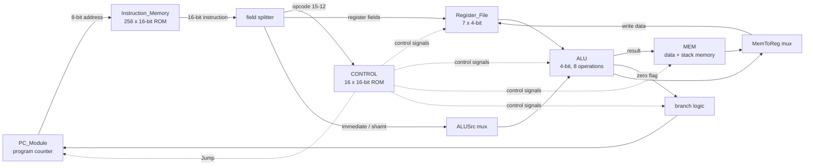
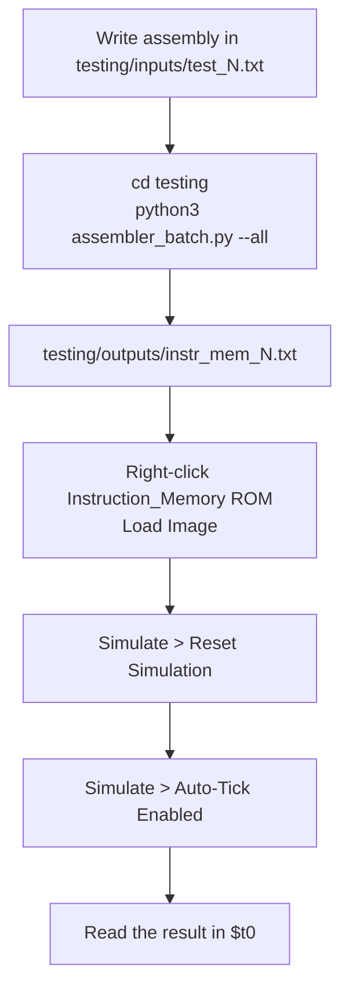

# 4-bit MIPS Processor

A working 4-bit MIPS processor designed and simulated in **Logisim Evolution**, built for
CSE 210 (Computer Architecture Sessional), January 2026 semester, BUET.

The machine has a 16-bit instruction word, a 4-bit data path, an 8-bit address bus, seven
4-bit registers, separate instruction and data memories, a stack, and a **microprogrammed
control unit** driven by a ROM. Assembly programs are converted to machine code by a Python
assembler included in this repo.

**Lab Group B1 &middot; Group ID 3**

---

## Requirements

| Tool | Version |
|---|---|
| Logisim Evolution | **v4.1.0** |
| Python | 3.8 or newer (standard library only, no packages to install) |

Open `MIPS_Processor.circ` in Logisim Evolution v4.1.0. Older Logisim (the original
2.7.1) will not open this file — the subcircuit appearance format and several component
attributes are Evolution-specific.

---

## Repository layout

```
.
├── MIPS_Processor.circ            the full processor — open this in Logisim Evolution
├── README.md
│
├── docs/
│   ├── Instruction_Table.pdf      our B1-3 opcode assignment
│   └── Jan_2026_CSE_210_MIPS.pdf  the assignment specification
│
├── individual_modules/            modules developed separately, before integration
│   ├── Control_Unit.circ
│   └── mipsALU.circ
│
└── testing/
    ├── assembler.py               assembler, single file at a time
    ├── assembler_batch.py         assembler, whole inputs/ folder at once
    ├── control_rom.txt            16 control words -> load into Control_ROM
    ├── tests.txt                  all ten test programs in one readable file
    ├── inputs/                    test_1.txt … test_10.txt
    └── outputs/                   instr_mem_1.txt … instr_mem_10.txt (generated)
```

`MIPS_Processor.circ` is the integrated design and the only file you need to open to run
anything. The two circuits under `individual_modules/` are kept for reference and for the
report — they show the ALU and control unit as they were built and tested in isolation
before being merged into the top-level circuit.

---

## The instruction set

Every group in the course gets a different opcode ordering. Ours is the **B1, Group 3**
sequence: `OJNCAEPLGKMFDBHI`.

| Opcode | Instruction | Type | | Opcode | Instruction | Type |
|---|---|---|---|---|---|---|
| `0000` | `bneq` | I | | `1000` | `or`   | R |
| `0001` | `srl`  | S | | `1001` | `nor`  | R |
| `0010` | `beq`  | I | | `1010` | `sw`   | I |
| `0011` | `sub`  | R | | `1011` | `andi` | I |
| `0100` | `add`  | R | | `1100` | `subi` | I |
| `0101` | `and`  | R | | `1101` | `addi` | I |
| `0110` | `j`    | J | | `1110` | `ori`  | I |
| `0111` | `lw`   | I | | `1111` | `sll`  | S |

### Instruction formats

All instructions are 16 bits, split into four 4-bit fields.

```
R-type    opcode | src1 | src2 | dst          add $t1, $t2, $t3
S-type    opcode | src1 | dst  | shamt        sll $t0, $t1, 2
I-type    opcode | src1 | dst  | immediate    addi $t0, $t1, 5
J-type    opcode |  target address  | 0000    j  loop
```

Note the operand order flips for R-type and S-type: you *write* the destination first, as in
normal MIPS assembly, but it is *encoded* last (R-type) or third (S-type). The assembler
handles this for you.

### Registers

| Name | Number | Notes |
|---|---|---|
| `$zero` | `0000` | hardwired to 0, writes are ignored |
| `$t0` | `0001` | general purpose — test programs leave their result here |
| `$t1` | `0010` | general purpose |
| `$t2` | `0011` | general purpose |
| `$t3` | `0100` | general purpose |
| `$t4` | `0101` | general purpose |
| `$sp` | `0110` | stack pointer |

`$sp` has no hardware preset, so the assembler emits `addi $sp, $zero, 1111` as the very
first instruction of every program. After that `$sp` points at the top of memory and the
stack grows downward.

---

## How the processor works

Execution is **single-cycle**: one instruction is fetched, decoded, executed, and written
back within one clock cycle. The five classical stages exist as separate subcircuits, but
there are no pipeline registers between them — a signal leaving the control ROM reaches its
consumer combinationally within the same cycle.

<!-- ================= FLOWCHART 1 — delete this block if it doesn't render ================= -->



<!-- ================= END FLOWCHART 1 ================= -->

### The modules

**`PC_Module`** — holds the 8-bit program counter and decides where it goes next. Internally
it computes `PC + 1`, adds the sign-extended branch offset for a taken branch, and then
selects between that and the absolute jump target. Two cascaded multiplexers, with jump
overriding branch.

**`Instruction_Memory`** — a 256 &times; 16-bit ROM addressed by the PC. This is where the
assembled program lives.

**`Register_File`** — seven 4-bit registers with two read ports and one write port. Reads are
combinational (two 16-to-1 multiplexers), writes are clocked and gated by `RegWrite` through a
demultiplexer. `$zero` ignores writes.

**`ALU`** — 4-bit, eight operations selected by a 3-bit code: add, subtract, AND, OR, NOR,
shift left, shift right, and a constant. It also produces a **Zero** flag used by the branch
logic.

**`MEM`** — data memory, also serving as stack memory. Addressed by the ALU result, so
`lw $t1, 4($sp)` reaches the stack simply by computing `$sp + 4`.

**`CONTROL`** — the microprogrammed control unit. See the next section.

### How they fit together

The opcode leaves the instruction splitter and enters `CONTROL`, which looks up a 16-bit
control word and fans it out to every other module. Each module then does exactly one of the
things it is capable of. The only combinational logic outside the modules is the branch gate
and three multiplexers (RegDst, ALUSrc, MemToReg).

Signals are routed with **tunnels** rather than long wires, so the top-level sheet stays
readable. A tunnel labelled `RegWrite` beside the control unit is electrically the same node
as every other tunnel labelled `RegWrite`.

---

## The control unit

The assignment requires a **microprogrammed** control unit: the control signals must live in
a ROM as *control words*, not in hardwired gates. Ours is a 16-row ROM addressed directly by
the 4-bit opcode. It has no clock and no state — it is a pure lookup table.

**13 control signals packed into a 16-bit word** (3 bits spare for future use):

| Bit | Signal | What it decides |
|---|---|---|
| 15 | `RegDst` | which instruction field names the destination register |
| 14 | `RegWrite` | whether the register file commits a write |
| 13 | `ALUSrc` | ALU input B: a register, or the immediate / shamt |
| 12 | `MemRead` | enables the data memory output |
| 11 | `MemWrite` | data memory stores this cycle |
| 10 | `MemToReg` | write-back value: memory, or the ALU result |
| 9 | `Branch` | this is a branch instruction |
| 8 | `BranchNE` | the branch is `bneq` rather than `beq` |
| 7 | `Jump` | unconditional jump |
| 6–3 | *spare* | reserved |
| 2–0 | `ALUOp` | which of the eight ALU operations to run |

`ALUOp` sits in the low three bits deliberately: the last hex digit of every control word
*is* the ALU operation, which makes the ROM contents readable at a glance.

| `ALUOp` | 0 | 1 | 2 | 3 | 4 | 5 | 6 | 7 |
|---|---|---|---|---|---|---|---|---|
| operation | add | sub | and | or | nor | sll | srl | const |

### Why `Branch` and `BranchNE` are separate

`PC_Module` expects a signal meaning *the branch is being taken*, not *this is a branch
instruction*. The control ROM cannot know that on its own — it depends on the ALU's Zero
flag, which does not exist until the comparison has actually run. So the ROM emits the branch
**type**, and one small gate at the top level combines it with Zero:

```
branchTaken = Branch AND (Zero XOR BranchNE)
```

For `beq` (`BranchNE = 0`) the XOR passes Zero through. For `bneq` (`BranchNE = 1`) it
inverts. For every other instruction `Branch = 0` and the AND holds the output low, so a
stray zero result can never cause an accidental jump.

### The 16 control words

| Addr | Instruction | Word | | Addr | Instruction | Word |
|---|---|---|---|---|---|---|
| 0 | `bneq` | `0301` | | 8 | `or` | `c003` |
| 1 | `srl` | `6006` | | 9 | `nor` | `c004` |
| 2 | `beq` | `0201` | | A | `sw` | `2800` |
| 3 | `sub` | `c001` | | B | `andi` | `6002` |
| 4 | `add` | `c000` | | C | `subi` | `6001` |
| 5 | `and` | `c002` | | D | `addi` | `6000` |
| 6 | `j` | `0087` | | E | `ori` | `6003` |
| 7 | `lw` | `7400` | | F | `sll` | `6005` |

Every don't-care bit is written as a hard `0`. On paper a don't-care is free, but a ROM cell
must hold *something*, and a stray `1` in `RegWrite` on a jump would silently corrupt a
register.

The words live in `testing/control_rom.txt` as a Logisim `v2.0 raw` image:

```
v2.0 raw
0301 6006 0201 c001 c000 c002 0087 7400 c003 c004 2800 6002 6001 6000 6003 6005
```

To change a signal, edit the corresponding hex word and reload the image into the ROM. The
bit layout table above tells you which bit to flip.

---

## The assembler

Two scripts, same assembler underneath:

- **`assembler.py`** — one file at a time. Handy for quick experiments.
- **`assembler_batch.py`** — assembles the whole `inputs/` folder in one command. This is the
  one to use for the test suite.

Both accept the same assembly syntax and produce Logisim `v2.0 raw` ROM images.

All commands below are run from inside the `testing/` folder:

```bash
cd testing
```

### Assembling all tests

```bash
python3 assembler_batch.py --all
```

```
  ok    inputs/test_1.txt    -> outputs/instr_mem_1.txt     11 instructions
  ok    inputs/test_2.txt    -> outputs/instr_mem_2.txt     11 instructions
  ...
  ok    inputs/test_10.txt   -> outputs/instr_mem_10.txt    17 instructions

10 assembled, 0 failed -> outputs/
```

The mapping is always `inputs/test_N.txt` &rarr; `outputs/instr_mem_N.txt`. Existing outputs
are overwritten, and a new `test_11.txt` is picked up automatically on the next run. If one
file has a syntax error the rest still assemble; the failure is reported with its line number.

### Assembling a single file

```bash
python3 assembler_batch.py inputs/test_3.txt    # still writes outputs/instr_mem_3.txt
python3 assembler.py inputs/test_3.txt          # single-file script
```

### Other options

| Flag | Effect |
|---|---|
| `-i DIR` | input directory (default `inputs`) |
| `-d DIR` | output directory (default `outputs`) |
| `-o FILE` | explicit output path, single-file mode only |
| `-q` | suppress the per-instruction listing |
| `--no-init-sp` | omit the automatic `$sp` initialisation |

Alongside each ROM the assembler writes a `.lst` listing with address, binary, hex and source
side by side. That file is what you want open when the simulation misbehaves and you need to
know what sits at address `0E`.

### Assembly syntax

```asm
# comments start with # (also ; and //)

        addi $t1, $zero, 7        # I-type
        add  $t0, $t1, $t2        # R-type
        sll  $t0, $t1, 2          # S-type
        lw   $t3, 4($sp)          # memory
        sw   $t3, 0($sp)
loop:   bneq $t1, $zero, loop     # labels resolve to PC-relative offsets
        j    loop                 # jumps resolve to absolute addresses
        push $t1                  # pseudo: subi $sp,$sp,1 ; sw $t1,0($sp)
        pop  $t2                  # pseudo: lw $t2,0($sp) ; addi $sp,$sp,1
        nop                       # pseudo: add $zero,$zero,$zero
```

Numbers may be written as `5`, `-3`, `0b0101` or `0xA`.

**Limits the assembler enforces**, with a clear error rather than a silent truncation:

- immediates must fit 4 bits: `-8` to `15`
- branch targets must be within `-8` to `+7` instructions
- jump targets must be `0`–`255`
- shift amounts `0`–`15`, with a warning above 3 (a 4-bit value shifted that far is always 0)

---

## Running a program in Logisim Evolution

<!-- ================= FLOWCHART 2 — delete this block if it doesn't render ================= -->



<!-- ================= END FLOWCHART 2 ================= -->

**Step 1 — load the control ROM.** This only needs doing once, unless the control words
change. Open the `CONTROL` subcircuit, right-click `Control_ROM` &rarr; **Load Image** &rarr;
select `testing/control_rom.txt`.

**Step 2 — load your program.** In `main`, right-click the `Instruction_Memory` ROM &rarr;
**Load Image** &rarr; select the `testing/outputs/instr_mem_N.txt` you want to run.

**Step 3 — reset.** **Simulate &rarr; Reset Simulation** (Ctrl+R). This clears the registers
and the PC. Do this before every run — several tests assume registers start at zero.

**Step 4 — run the clock.** Under the **Simulate** menu:

1. **Simulation Enabled** must be checked (Ctrl+E).
2. **Auto-Tick Enabled** (Ctrl+K) free-runs the clock.
3. **Auto-Tick Frequency** sets the speed — 4 Hz or 8 Hz to watch registers change, higher
   to just get the answer.

> **One tick is a half cycle.** The clock rises on one tick and falls on the next, and
> registers latch on the rising edge, so **one instruction takes two ticks**. When you are
> counting steps by hand, use **Tick Once** twice per instruction.

**Step 5 — read the result.** Every test program leaves its answer in `$t0`. Programs ending
in `halt: j halt` spin harmlessly on that instruction, so you can leave auto-tick running and
read `$t0` whenever you look.

---

## Test suite

Ten programs in `testing/inputs/`, ordered so that each one depends only on behaviour the earlier
ones already prove. Run them in sequence: the first failure points at a specific module
instead of leaving you to guess among six.

| File | What it exercises | Expected `$t0` |
|---|---|---|
| `test_1.txt` | `add`, `addi`, `sub`, `subi` | `1000` (8) |
| `test_2.txt` | `and`, `or`, `nor`, `andi`, `ori` | `1001` (9) |
| `test_3.txt` | `sll`, `srl`, 4-bit truncation | `0001` (1) |
| `test_4.txt` | `beq` taken and not taken | `1000` (8) |
| `test_5.txt` | 2-iteration `bneq` loop | `0011` (3) |
| `test_6.txt` | 5-iteration `bneq` loop | `1000` (8) |
| `test_7.txt` | `sw` / `lw` through data memory | `1111` (15) |
| `test_8.txt` | stack push and pop via `$sp` | `1001` (9) |
| `test_9.txt` | two forward jumps | `0110` (6) |
| `test_10.txt` | factorial(3) — stack plus nested loops | `0110` (6) |

All ten are also collected in `testing/tests.txt`, one after another with headers, if you
would rather read them in a single file.

`test_5.txt` is the best place to start: nine instruction executions, done in seconds under
auto-tick, and it covers the whole fetch–decode–branch path.

`test_10.txt` is the most interesting. There is no `mul` instruction and no function-call
mechanism, so factorial is built the way recursion actually works underneath — a descent loop
pushes 3, 2, 1 onto the stack like call frames, an ascent loop pops them back off, and an
inner loop performs each multiplication as repeated addition.

> Three is the largest factorial this machine can represent. `4! = 24` overflows four bits
> and wraps to 8.

---

## Special features

- **Stack memory** with `$sp`, initialised automatically at program start
- **`push` / `pop` pseudo-instructions** in the assembler, expanded before addresses are
  assigned so labels and branch offsets stay correct
- **Batch assembler** with a listing file per program for debugging
- **16-bit control word** with spare bits, so adding a signal does not require rebuilding
  the ROM width or the splitter

---

## Team

| Name | Student ID |
|---|---|
| Ahnaf Jamil | 2305079 |
| | |
| | |
